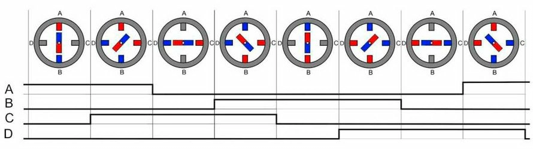
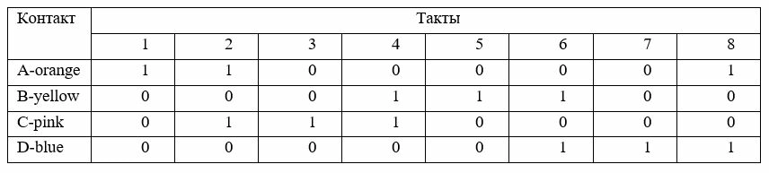

# Лабораторная работа: Управление шаговым двигателем

В этом проекте Вам предлагается освоить управление шаговым двигателем (ШД) 28BYJ-48.

## Задание 1
По аналогии с функцией 
```c
void plt_stepper_full(uint8_t step_n)
```
напишите свою функцию ```void plt_stepper_half(uint8_t half_step_n)``` которая выполняет шаг ШД в полушаговом режиме


## Задание 2

Доработайте функцию
```c
/**
 * @brief вращает шаговый двигатель в заданном направлении
 *
 * @param dir - направление вращения, <-1> - против часовой стрелки, <1> - по часовой стрелке
 * <0> - двигатель остановлен
 * @return return
 */
void plt_stepper(int dir)
{
	/* */
//	static int step_n = 0;
//	switch (step_n) {
//		case value:
//
//			break;
//		default:
//			break;
//	}
}
```
таким образом чтобы вызывая эту функцию в циклическом режиме (в ```plt_process()```) шаговый двигатель вращался по направлению в соответствии с аргументом ```int dir``` (см описание функции ```void plt_stepper(int dir)```) 

---
## Справка по static

## **`static int step_n = 0;` — объявление статической переменной**

### **Два контекста использования `static` для переменных:**

---

## **1. `static` внутри функции (локальная статическая переменная)**

```c
void my_function(void) {
    static int step_n = 0;  // инициализируется один раз
    step_n++;
    printf("Шаг: %d\n", step_n);
}
```

### **Особенности:**
- **Область видимости:** только внутри функции (как обычная локальная переменная).
- **Время жизни:** на протяжении всей работы программы (как глобальная).
- **Инициализация:** **один раз** при первом вызове функции.
- **Значение сохраняется** между вызовами функции.

**Пример работы:**
```c
my_function(); // Шаг: 1
my_function(); // Шаг: 2
my_function(); // Шаг: 3
```

### **Зачем используется:**
- Счётчик вызовов функции.
- Сохранение состояния между вызовами (конечные автоматы, пошаговые операции).
- Ленивая инициализация (однократное создание ресурса).

---

## **2. `static` на уровне файла (глобальная статическая переменная)**

```c
// file.c
static int step_n = 0;  // видна только в этом файле

void func1(void) {
    step_n++;
}

void func2(void) {
    step_n = 0;
}
```

### **Особенности:**
- **Область видимости:** только в пределах одного файла (модуля).
- **Время жизни:** вся программа.
- **Инкапсуляция:** другие файлы не имеют доступа к этой переменной (даже через `extern`).

### **Зачем используется:**
- Скрытие деталей реализации (принцип инкапсуляции).
- Предотвращение конфликтов имён в больших проектах.
- Создание "приватных" глобальных переменных модуля.

---

## **Сравнение:**

| Свойство | Локальная static | Глобальная static | Обычная глобальная |
|----------|------------------|-------------------|-------------------|
| Видимость | Внутри функции | Внутри файла | Вся программа |
| Время жизни | Вся программа | Вся программа | Вся программа |
| Инициализация | 1 раз при первом вызове | При запуске программы | При запуске программы |
| Доступ из других файлов | Нет | Нет | Да (через extern) |